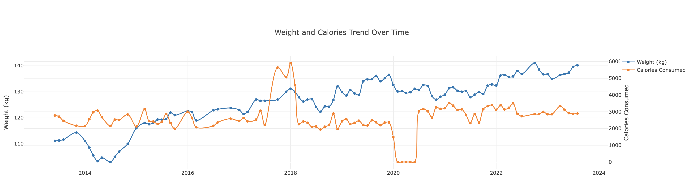

# My Fitness Pal Analyser

Built almost entirely by ChatGPT with some guidance from me

##### You must ask the right questions

Chat references

https://chat.openai.com/share/224e8608-618f-451e-8adc-de1994bff059
https://chat.openai.com/share/64e4c6cd-eebb-4667-99f9-3f9ffdc928ed

#### What this app does

- Takes all data from your MFP exports
a. Measurements (aka, weight)
b. Exercise summaries
c. Nutrition
- It merges all that data into dates
- It plots all the data to a UI grouped by month

### Quickstart Guide

#### Getting your data from MFP

You must first export all your data from MFP. This can be done for 7 days for free or since account creation if you have premium.

1. Go to https://www.myfitnesspal.com/reports/export
2. Click download
3. Wait for email
4. Download file and place contents in `raw`
5. ????
6. Profit

#### Running the app

###### Delete example data first.

1. `yarn install`
2. `yarn merge`
3. `yarn ui`
4. Open `http://localhost:3000`
5. ????
6. More profit

#### Some example graphs

